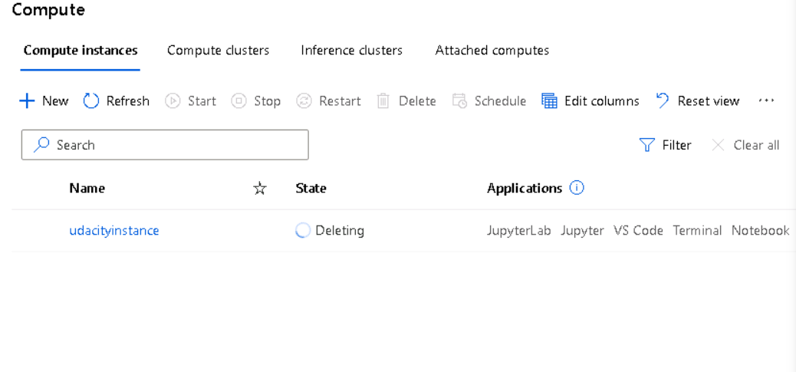
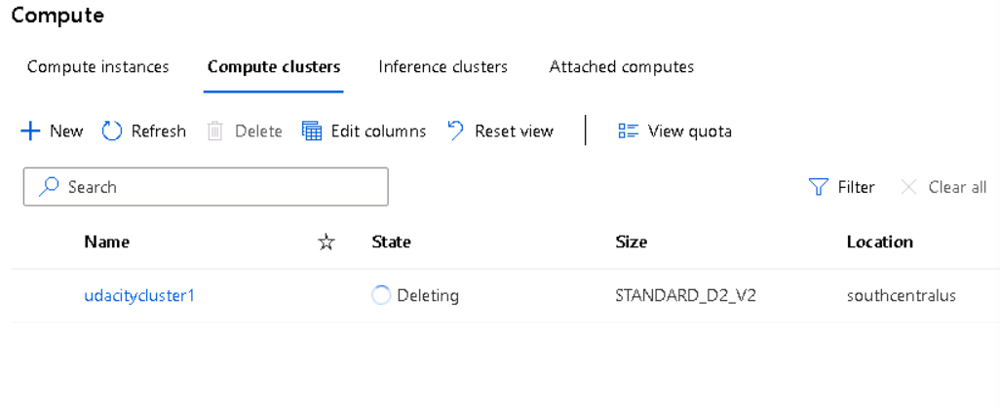

# Optimizing an ML Pipeline in Azure

## Overview
This project is part of the Udacity Azure ML Nanodegree.
In this project, we build and optimize an Azure ML pipeline using the Python SDK and a provided Scikit-learn model.
This model is then compared to an Azure AutoML run.

## Useful Resources
- [ScriptRunConfig Class](https://docs.microsoft.com/en-us/python/api/azureml-core/azureml.core.scriptrunconfig?view=azure-ml-py)
- [Configure and submit training runs](https://docs.microsoft.com/en-us/azure/machine-learning/how-to-set-up-training-targets)
- [HyperDriveConfig Class](https://docs.microsoft.com/en-us/python/api/azureml-train-core/azureml.train.hyperdrive.hyperdriveconfig?view=azure-ml-py)
- [How to tune hyperparamters](https://docs.microsoft.com/en-us/azure/machine-learning/how-to-tune-hyperparameters)

## Summary
**In 1-2 sentences, explain the problem statement: e.g "This dataset contains data about... we seek to predict..."**
Reference: https://archive.ics.uci.edu/ml/datasets/bank+marketing
As per reference, this dataset contains data about marketing campaigns of a banking institution. We seek to predict if the client would subscribe to a term deposit which is labeled as "y".
**In 1-2 sentences, explain the solution: e.g. "The best performing model was a ..."**
The best performing model was a Voting Ensemble model derived from AutoML with accuracy of 0.917.
## Scikit-learn Pipeline
**Explain the pipeline architecture, including data, hyperparameter tuning, and classification algorithm.**
First, the data was downloaded as a TabularData from the given webpath. Thereafter, data preprocessing (i.e. one-hot encoding) was done to prepare the data for model training. Logistic Regression algorithm was used in train.py for classification. The parameters chosen for hyperparameter tuning was C and max_iter. Values of C used for hyperparameter tuning are 0.1, 1, 5, 10 while those for max_iter are 500, 1000, 4000, 10000. RandomParameterSampling was used as the parameter sampler and BanditPolicy was used as the early stopping policy. 
**What are the benefits of the parameter sampler you chose?**
RandomParameterSampling can get good results and not as time-consuming as grid sweep.
**What are the benefits of the early stopping policy you chose?**
BanditPolicy allows one to terminate a job when the metric is not within the slack amount of the most successful job. Hence, it can also result in good results without being time-consuming.
## AutoML
**In 1-2 sentences, describe the model and hyperparameters generated by AutoML.**
The model generated by AutoML is an VotingEnsemble model consisting of XGBoost, SGD, LightGBM with various data transformation methods like StandardScaleWrapper, MaxAbsScaler, StandardScalerWrapper, SparseNormalizer.
## Pipeline comparison
**Compare the two models and their performance. What are the differences in accuracy? In architecture? If there was a difference, why do you think there was one?**
There is not much difference in accuracy for both models. The best run using LogisticRegression with C:0.1 and max_iter:1000, the accuracy was 0.91684 while the best run using AutoML (with the VotingEnsemble model) gave 0.91757. For AutoML, 5-fold cross-validation was added in the training pipeline while that was not added for LogisticRegression.
## Future work
**What are some areas of improvement for future experiments? Why might these improvements help the model?**
For RandomParameterSampling, the max run was set at 4 which can be increased to a higher number which might result in more permutations and higher probability of finding better parameters. 
For AutoML, the time limit was set to timeout at 30mins which can also be increased to allow longer training and evaluations of more models and parameters and in turn higher probability of finding models which can result in higher accuracy. 
## Proof of cluster clean up
**If you did not delete your compute cluster in the code, please complete this section. Otherwise, delete this section.**
**Image of cluster marked for deletion**

